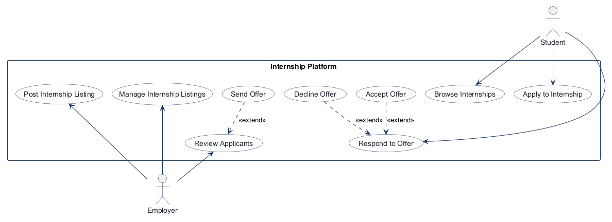
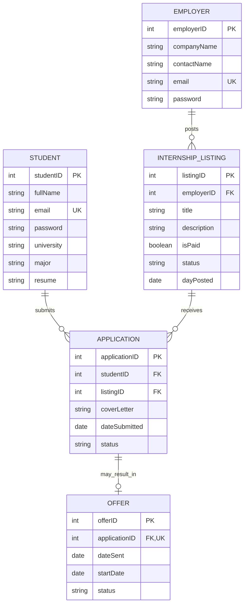
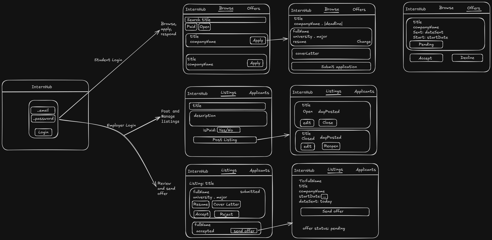

# COMP 3613 Assignment 1

Draft this file with the Guide. **Update it after every phase milestone** before you pause. The use-case diagram is a UML PNG at `docs/diagrams/use-case.png`, linked from this file as `diagrams/use-case.png` (path relative to `docs/report.md`). The model diagram is Mermaid. **Embed wireframe images** as `wireframes/<file>` (files live in `docs/wireframes/`).

Do not put your student ID in this file if you will commit it. The PDF cover adds your name and ID at export time.

## Assigned project
Internship Platform

## Three workflows

### 1. Browse and apply to internships (Student)

### 2. Post and manage internship listings (Employer)

### 3. Review applicants and send offers (Employer)

## Use case diagram

The Student and Employer use cases are separate, with no use cases shared across roles. The compound workflows are split into `Browse Internships` / `Apply to Internship`, `Post Internship Listing` / `Manage Internship Listings`, and `Review Applicants` / `Send Offer`. `Send Offer` extends `Review Applicants`; `Accept Offer` and `Decline Offer` extend the Student's `Respond to Offer` use case.

## Model diagram

Phase 3 first draft. Update this section in Phase 5 if implementation polish changes the model.

`Application` resolves the Student-to-InternshipListing many-to-many relationship; `(studentID, listingID)` is unique, so a student cannot apply to the same listing twice. `Offer.applicationID` is unique, allowing at most one Offer per Application. Emails are unique within each entity. Applications are allowed only while a listing is open. An Employer may create an Offer only for an Application with status `accepted` (Employer-selected); `Offer.status = accepted` means the Student accepted the offer. Listing statuses are `open` / `closed`; application statuses are `submitted` / `under review` / `accepted` / `rejected`; offer statuses are `pending` / `accepted` / `declined`.

## Wireframes

### Internship Platform workflows

Coverage: the image shows the student browse, application, and offer screens, plus employer listing creation/management and applicant review/offer screens. The login screen is supporting authentication. Existing ERD fields cover the labels, filters, dates, and statuses shown, so no model revision is proposed for Phase 4.

<!-- student-build:wireframe-coverage
use_case: Browse Internships
image: docs/wireframes/wireframe_diagram.excalidraw.png
covered: yes
-->
<!-- student-build:wireframe-coverage
use_case: Apply to Internship
image: docs/wireframes/wireframe_diagram.excalidraw.png
covered: yes
-->
<!-- student-build:wireframe-coverage
use_case: Respond to Offer
image: docs/wireframes/wireframe_diagram.excalidraw.png
covered: yes
-->
<!-- student-build:wireframe-coverage
use_case: Accept Offer
image: docs/wireframes/wireframe_diagram.excalidraw.png
covered: yes
-->
<!-- student-build:wireframe-coverage
use_case: Decline Offer
image: docs/wireframes/wireframe_diagram.excalidraw.png
covered: yes
-->
<!-- student-build:wireframe-coverage
use_case: Post Internship Listing
image: docs/wireframes/wireframe_diagram.excalidraw.png
covered: yes
-->
<!-- student-build:wireframe-coverage
use_case: Manage Internship Listings
image: docs/wireframes/wireframe_diagram.excalidraw.png
covered: yes
-->
<!-- student-build:wireframe-coverage
use_case: Review Applicants
image: docs/wireframes/wireframe_diagram.excalidraw.png
covered: yes
-->
<!-- student-build:wireframe-coverage
use_case: Send Offer
image: docs/wireframes/wireframe_diagram.excalidraw.png
covered: yes
-->

## Theming

InterHub uses navy as its primary color, teal accents, warm coral highlights, white / light-grey backgrounds, and Manrope + DM Sans sans-serif typography. Green, amber, and red status-label tokens are defined for workflow states. The landing, login, and registration pages now use the InterHub wordmark and theme. The placeholder `/app` and `/admin` pages are removed; authentication and `/config` remain.

## Implementation notes

Phase 5 is verified locally for the core internship workflows. The app includes a branded student dashboard at `internships.html`, a dedicated `My activity` area for applications and offers, and the employer workflow for posting, editing, reviewing applicants, sending offers, and rejecting applications. The route layer remains thin and delegates to the service/repository stack, while the model keeps the one-to-one User-to-Student and User-to-Employer mappings, unique application rules, and file-attachment metadata for employer downloads.

The project was checked in a live local runtime: `python -m pytest tests/test_internship_workflows.py -q` passed with 7 passing tests, `python manage.py init` created the full schema successfully, and `python manage.py run` started the app on http://0.0.0.0:5000 without startup errors. The browser also loaded the InterHub landing page successfully at http://127.0.0.1:5000/.

## Deployed app

Phase 6 is live on Render.

https://faststarter-b222.onrender.com

## Logins

Every account a marker needs, including extra users you added. Starter accounts:

- bob / bobpass — student
- admin / adminpass — employer

## YouTube URL

## Session transcripts

Filled when the Guide builds the report: the agent writes each Guide chat to `docs/transcripts/<slug>.md` (Copilot Agent, Cursor, or OpenCode). `python manage.py report` packages them. Do not paste chats here during the build.

## Competency (student-judge)

Filled when the report is built. Guide runs student-judge, writes `docs/judge.md`, and export appends the scorecard here.

## Skill integrity

Filled by `python manage.py report`. Do not edit the course skills.
